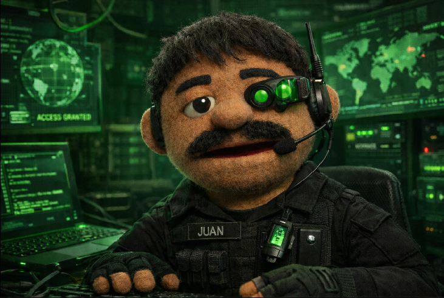

# 👋 Hola, soy Juan

💻 Estudiante de Ingeniería en Sistemas | IT Support | Redes y Ciberseguridad  
📍 Cancún, México

## 🚀 Tecnologías
- Networking: Cisco, Wireshark, Nmap
- Sistemas: Windows / Linux
- Programación: C++, Python, HTML/CSS

  

## 📫 Contacto
- LinkedIn: (tu link)
- Email: (opcional)
